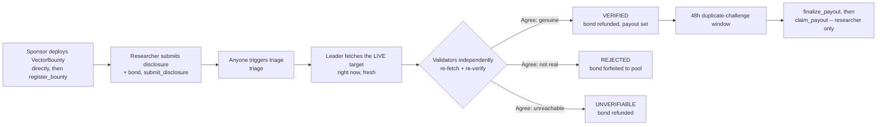

# Vector

**Verified vulnerability disclosure escrow.**

Security researchers disclose vulnerabilities against a live public target. GenLayer validators
independently fetch that real target and verify the disclosure is genuine and correctly
severity-rated before any bounty pays out. There is no centralized triage team anywhere in the
system — the verification itself is the trustless part.

- **Network:** GenLayer Studio Devnet (`studio-dev`, chain id `61997`, Consensus v0.6 RC — see [`CLAUDE.md`](./CLAUDE.md))
- **VectorFactory address:** [`0x99Af5CE83F0856185C80E82B642336270d8c55ab`](https://explorer-studio-dev.genlayer.com/address/0x99Af5CE83F0856185C80E82B642336270d8c55ab)
- **RPC:** https://studio-dev.genlayer.com/api
- **Explorer:** https://explorer-studio-dev.genlayer.com/ _(load-tested live 2026-09-11; not declared in the `genlayer-js` chain preset, so the frontend falls back to this URL manually — see `TransactionPanel.tsx`)_

## The trust problem

Every bug bounty program today has the same weak point: a centralized triage team decides what
counts as "real," how severe it is, and whether it pays. That team can be slow, inconsistent,
conflicted (they often work for the same organization being disclosed against), or simply wrong —
and a researcher has no recourse but to trust their judgment.

Vector removes that single point of trust. The contract itself fetches the live target and checks
the claim. Multiple independent validators do this separately, from scratch, and a verdict only
becomes real if they agree.

## The solution



No single model's opinion, and no researcher's own narrative, ever reaches chain state unchecked —
a verdict only lands once independent validators, each doing the real fetch and the real reasoning
themselves, reach the same conclusion. See [`docs/RESOLUTION_LOGIC.md`](./docs/RESOLUTION_LOGIC.md)
for the complete state machine.

## Why this needs GenLayer

Verifying "is this vulnerability real, and how bad is it" against a live website requires reading
and judgment — exactly what a deterministic smart contract can't do, and exactly what a single
off-chain oracle can't be trusted to do neutrally when the target being checked might be the same
party paying the oracle. GenLayer's Equivalence Principle makes that judgment cryptoeconomically
trustworthy: independent validators each fetch the real target and reason from scratch, and a
verdict only becomes canonical once they agree.

## How to use it

**1. A sponsor opens a program** — two transactions, not one (see [`docs/ARCHITECTURE.md`](./docs/ARCHITECTURE.md) for why: a Consensus v0.6 platform gap means the factory can't deploy the child itself):

```
bounty_code = VectorFactory.get_bounty_code()
bounty_address = deploy(bounty_code, args=[factory_address, title, description, target_url, severity_critical_wei, severity_high_wei, severity_medium_wei, severity_low_wei, disclosure_bond_wei])
VectorFactory.register_bounty(bounty_address)
```

**2. A researcher submits a disclosure**, bonded at the program's exact `disclosure_bond`:

```
VectorBounty.submit_disclosure(title, description, repro_steps, target_ref, claimed_severity) -> disclosure_id
```

**3. Anyone triggers triage** (permissionless — often the researcher themselves):

```
VectorBounty.triage(disclosure_id)
```

**4. Once `VERIFIED` and the 48h challenge window elapses**, the researcher claims their payout:

```
VectorBounty.finalize_payout(disclosure_id)   # permissionless
VectorBounty.claim_payout(disclosure_id)      # researcher-only
```

See [`docs/AGENT_SDK.md`](./docs/AGENT_SDK.md) for a full programmatic reference, including a
minimal autonomous-agent loop.

## Contract interface

**VectorFactory**

| Method | Type | Description |
|---|---|---|
| `get_bounty_code()` | view | The exact `VectorBounty` source to deploy before registering. |
| `register_bounty(bounty_address)` | write, payable | Cross-contract-reads the already-deployed `bounty_address`'s own state and lists it, gated by the creation stake. |
| `withdraw_fees()` | write | Owner-only. Recovers accumulated creation stakes. |
| `get_bounties()` / `get_bounties_page(offset, limit)` | view | The full (or paged) registry of deployed programs. |
| `get_bounty_meta(address)` | view | Creation-time metadata for one program. |
| `get_bounties_by_sponsor(sponsor)` | view | All programs a given address sponsors. |

**VectorBounty**

| Method | Type | Description |
|---|---|---|
| `fund_pool()` | write, payable | Permissionless. Tops up this program's payout pool directly. |
| `submit_disclosure(...)` | write, payable | Bonds and submits a new disclosure. |
| `triage(disclosure_id)` | write | The Intelligent Contract core — fetches the live target, verifies under consensus. |
| `challenge_duplicate(disclosure_id, prior_disclosure_id)` | write | Opens a duplicate challenge within the 48h window. |
| `resolve_duplicate(disclosure_id)` | write | Adjudicates an open challenge under consensus. |
| `finalize_payout(disclosure_id)` | write | Permissionless. Moves a verified disclosure to claimable. |
| `claim_payout(disclosure_id)` | write | Researcher-only. Pulls the actual payout. |
| `expire_disclosure(disclosure_id)` | write | Permissionless escape hatch after 7 days stuck pending/triaging. |
| `close_bounty()` / `withdraw_unused_pool()` | write | Sponsor-only lifecycle management. |
| `get_bounty_info()` / `get_disclosure(id)` / `get_disclosures_by_status(status)` / `get_disclosures_by_researcher(addr)` / `get_claimable(id, addr)` / `is_claimed(id)` | view | Full state reads. |

## Architecture: deploy-then-register, no cross-contract writes

Cross-contract **writes** are confirmed to silently no-op on this GenVM build — a calling
contract's transaction reaches `ACCEPTED` cleanly, but the target contract's state never actually
changes. Cross-contract **views** do work, and are how `register_bounty` reads a newly-deployed
bounty's real state rather than trusting the caller. Vector's factory doesn't deploy `VectorBounty`
itself at all — a separate Consensus v0.6 platform gap makes any write that triggers an internal
deploy/call message unexecutable right now, confirmed live. The sponsor deploys directly instead,
then registers. See [`docs/ARCHITECTURE.md`](./docs/ARCHITECTURE.md) for the full rationale,
including why pool funding is a direct payable call rather than money forwarded through the
factory, and [`SECURITY.md`](./SECURITY.md) for the platform-gap findings.

## Project layout

```
vector/
├── contracts/
│   ├── VectorFactory.py        # registry + on-chain factory
│   └── VectorBounty.py         # per-program escrow + triage state machine
├── tests/
│   ├── direct/                 # gltest direct-mode unit tests (62/77 passing -- the remaining 12
│   │                           #   hit a narrow gltest limitation around vm.warp() across calls,
│   │                           #   not a contract bug; see SECURITY.md)
│   └── integration/            # live-network integration tests -- deploy, register, submit,
│                               #   triage, self-dealing rejection, all against a real node
├── deploy/001_deploy_vector_factory.ts
├── frontend/                   # Next.js 15 app
└── docs/                       # ARCHITECTURE, RESOLUTION_LOGIC, AGENT_SDK, AUDIT
```

## Local development

**Contracts:**

```bash
pip install -r requirements.txt
npm run lint:contracts
npm run test:direct
```

**Frontend:**

```bash
cd frontend
npm install
npm run dev
```

**Deploy** (see [`CLAUDE.md`](./CLAUDE.md) — never run without deliberately confirming wallet/network first):

```bash
PRIVATE_KEY=0x... CREATION_STAKE_WEI=0 npm run deploy:factory -- studio-dev
```

## License

MIT — see [`LICENSE`](./LICENSE).
